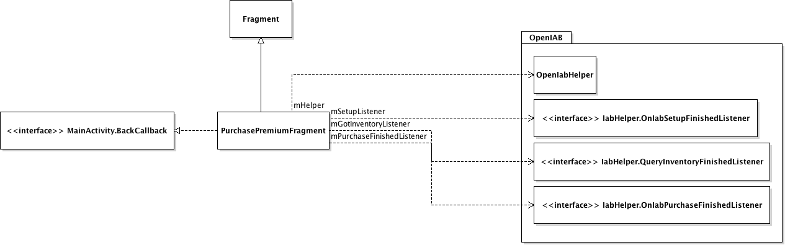

# In-app payment #

**Note**: The SKU product identifiers used in the example application are for
test products and should be replaced with real products IDs. Also the Google
In-App Billing public key needs to be replaced with a valid key for the in-app
purchase to work.

## Implementation ##

The in-app purchase functionality of the example application demonstrates how
purchasing a "premium version" of the application with unlimited functionality
is implemented using functionality provided by the
[OpenIAB](https://github.com/onepf/OpenIAB) library. The OpenIAB library is a
wrapper component that encapsulates the use of different in-app purchase APIs,
in this case the **Nokia In-App Payment** and **Google Play**, behind a single
easy-to-use API.

All the implementation related the in-app purchase functionality is implemented
in the
[PurchasePremiumFragment class](https://github.com/nokia-developer/capture-the-flag/blob/master/capture-the-flag/src/com/nokia/example/capturetheflag/PurchasePremiumFragment.java)
of the example application. The class provides the UI fragment for the
purchasing view and uses the IAB library's APIs to perform all the parts of the
in-app purchase process.

1. The OpenIAB component set up is started asynchronously when the
   `PurchasePremiumFragment` is created by calling
   `OpenIabHelper.startSetup(...)`.
2. Once the OpenIAB component setup is complete, the given
   `OnIabSetupFinishedListener`'s `onIabSetupFinished(IabResult result)` method
   is called. If the setup was successful the listener (`mSetupListener`)
   requests the list of available and already purchased products by calling
   `OpenIabHelper.queryInventoryAsync(...)`.
3. When then inventory information is received the given
   `QueryInventoryFinishedListener`'s (`mGotInventoryListener`)
   `onQueryInventoryFinished(...)` method is called with the inventory
   information. If the "premium" product is found from the list of purchasable
   products, the product information and price are updated to the UI. Also, if
   the "premium" product is found from the list of already purchased items, the
   feature will then be unlocked.
4. If the user chooses to purchase the "premium" product by pressing the
   "Upgrade" button the purchase flow is started simply by calling the
   `OpenIabHelper.launchPurchaseFlow(...)` method.
5. Once the in-app purchase flow is complete the given
   `OnIabPurchaseFinishedListener`'s (`mPurchaseFinishedListener`)
   `onIabPurchaseFinished` method is called with the purchase result and
   information. If the purchase was successful and the purchase payload
   verified, the "premium" feature will be marked as purchased and the related
   functionality unlocked.

## Related documentation ##

* [OpenIAB on GitHub](https://github.com/onepf/OpenIAB)
* [Nokia In-App Payment API documentation (Nokia X Developer's Libary)](http://developer.nokia.com/resources/library/nokia-x/nokia-in-app-payment.html)
