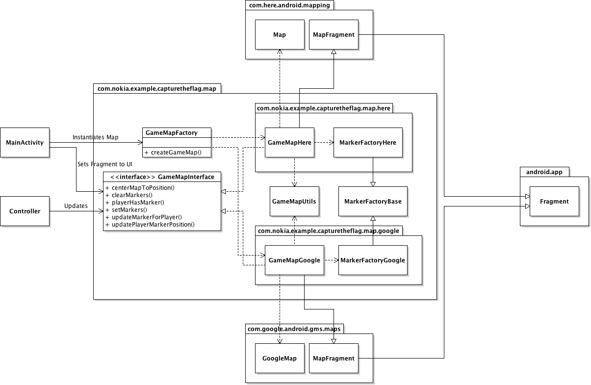
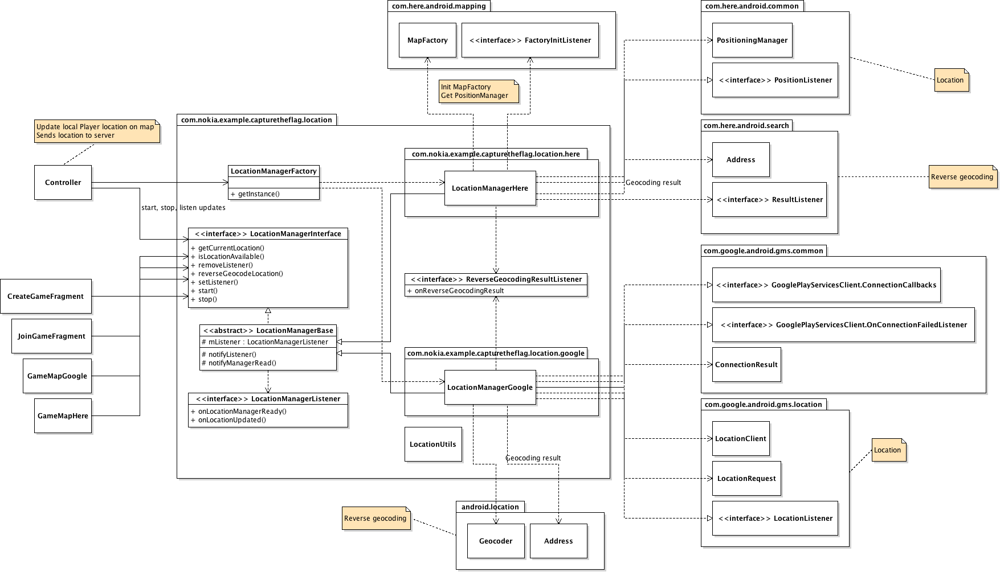

# Maps #



## Usage ##

The game map is created by
[MainActivity](https://github.com/nokia-developer/capture-the-flag/blob/master/capture-the-flag/src/com/nokia/example/capturetheflag/MainActivity.java)
using [GameMapFactory](https://github.com/nokia-developer/capture-the-flag/blob/master/capture-the-flag/src/com/nokia/example/capturetheflag/map/GameMapFactory.java)'s
static `createGameMap(Context context)` method. If the factory function finds
**HERE Maps** APIs on the device it creates a new
[GameMapHere](https://github.com/nokia-developer/capture-the-flag/blob/master/capture-the-flag/src/com/nokia/example/capturetheflag/map/here/GameMapHere.java)
instance for a **HERE Maps** specific map implementation and returns it. If
**HERE Maps** are not found, an instance of **Google Maps Android API v2**
specific implementation class
[GameMapsGoogle](https://github.com/nokia-developer/capture-the-flag/blob/master/capture-the-flag/src/com/nokia/example/capturetheflag/map/google/GameMapGoogle.java)
is returned instead:

```java
private static final String HERE_MAP_CLASS_NAME = "com.here.android.mapping.Map";
private static final String HERE_GAME_MAP_CLASS_NAME = "com.nokia.example.capturetheflag.map.here.GameMapHere";
private static final String GOOGLE_GAME_MAP_CLASS_NAME = "com.nokia.example.capturetheflag.map.google.GameMapGoogle";

public static boolean isHereMapsAvailable() {
    boolean available = true;

    try {
        Class.forName(HERE_MAP_CLASS_NAME);
    } catch (ClassNotFoundException e) {
        available = false;
    }

    return available;
}


public static GameMapInterface createGameMap() {
    GameMapInterface map = null;
    String className = isHereMapsAvailable() ? HERE_GAME_MAP_CLASS_NAME : GOOGLE_GAME_MAP_CLASS_NAME;
    map = (GameMapInterface) Class.forName(className).newInstance();
    return map;
}
```

Once the game map is instantiated, `MainActivity` sets it to the UI as a
`Fragment` and also passes a reference to the `GameMapInterface` to the game's
`Controller` instance. The `Controller` is then responsible for updating the map
through the set of methods declared in `GameMapInterface` when the local
player's location changes or updates for other player's positions are received
from the game server.

## `GameMapInterface` ##

The map functionality of the game is used through the `GameMapInterface`. The
interface declares the following public methods for controlling the map:

* `void centerMapToPosition(Location location)`: Centers the game map to the
  coordinates defined by `location`.
* `void clearMarkers()`: Clears all existing player and map markers from the
  map. Effectively prepares the map for a new game.
* `void updateMarkerForPlayer(Player updated, Player old)`: Refreshes an
  existing (`old`) player marker with `updated` data.
* `void updatePlayerMarkerPosition(Player player)`: Updates the position of an
  existing marker on the map for the given `player` or creates a new marker for
  the `player` if one doesn't already exist.
* `boolean playerHasMarker(Player player)`: Returns `true` if `player` already
  has a marker on the map.
* `void setMarkers(Game game)`: Sets up markers for the given `game`. Creates
  map markers for all the players and flags for both teams participating in the
  `game`.

## Implementation ##

The `GameMapHere` and `GameMapGoogle` classes along with the respective
`MarkerFactoryHere` and `MarkerFactoryGoogle` classes contain all the
platform-specific map implementations for **HERE Maps** on **Nokia X** devices
and **Google Maps** (API v2) on **Android** devices.

The basic functionality and logic of both map implementations is quite
identical, the main difference being the names of the platform-specific classes
and interfaces used in the implementations and e.g. how the map markers are
created and added to and removed from the map on the two platforms.

The `GameMapHere` implementation uses `com.here.android.mapping.Map` as the main
map control where `GameMapGoogle` uses `com.google.android.gms.maps.GoogleMaps`.
Also, both map implementations extend a different, platform-specific
`MapFragment` implementations that extend the `android.app.Fragment` base class.
  
Both game maps use a private `HashMap` for keeping track of the player markers
(`com.here.android.mapping.MapMarker` for **HERE Maps** and
`com.google.android.gms.maps.model.Marker` and `MarkerOptions` for **Google
Maps**) on the map. The HashMap is updated when player markers are added to or
removed from the game map.

`MarkerFactoryHere` and `MarkerFactoryGoogle` contain a set of static
platform-specific utility methods for creating both player and flag markers.

Flag markers are handled separately from the player markers and their sizes
scaled asyncronously based on the current zoom level of the map. The
`GameMapUtils` class contains a utility method for calculating a
meters-per-pixel value based on the current map zoom level which is used when
scaling the flag markers.

# Location #



## Usage ##

Location information is used by the game to update the local player's (device's)
location on the game map and sending the location information to other players
through the game server.

Location information is retrieved through `LocationManagerInterface` which
encapsulates the use of platform-specific location information API. The
`LocationManagerInterface` can be obtained by calling
`LocationManagerFactory.getInstance(Context context)` which returns the
interface for using a singleton instance of either `LocationManagerHere` or
`LocationManagerGoogle` depending on the platform, **Nokia X** or **Android**,
the application is running on.

## `LocationManagerInterface` ##

The `LocationManagerInterface` declares the following public methods:

* `boolean isLocationAvailable()`: Returns `true` of location information is
  available.
* `void start()`: Starts receiving location updates. The updates are notified to
  the currently set `LocationManagerListener`.
* `void stop()`: Stops receiving location updates.
* `void setListener(LocationManagerListener listener)`: Sets a
  `LocationManagerListener` for receiving location updates.
* `void removeListener()`: Removes the currently set `LocationManagerListener`.
* `Location getCurrentLocation()`: Returns the current `Location`.
* `void reverseGeocodeLocation(Location location, final ReverseGeocodingResultListener listener)`:
  Makes reverse geocoding request for receiving human-readable address for the
  given `Location`. The result of the reverse geocoding operation is delivered
  to the given `ReverseGeocodingResultListener`.

The `LocationManagerInterface` also declares a `ReverseGeocodingResultListener`
with the following public method for receiving reverse geocoding results:

* `void onReverseGeocodingResult(String result)`: Address for the `Location`
  given to `reverseGeocodeLocation(...)`.

## `LocationManagerListener` interface ##

Location updates are delivered through the `LocationManagerListener` interface,
which declares the following public methods:

* `void onLocationManagerReady(boolean success)`: Called when Location Manager
  has connected to the underlying location information provider or if the
  connection failed.
* `void onLocationUpdated(Location location)`: Called when device's location has
  changed.

## Implementation ##

The platform-specific location manager implementations, `LocationManagerHere`
for the **Nokia X** platform and `LocationManagerGoogle` for **Android**
devices, both implement the `LocationManagerInterface` and extend the
`LocationManagerBase` class. The base class contains listener-related
functionality shared between the two implementations.

The application's `Controller`, in its `onCreate(Bundle savedInstance)` method,
sets itself as a `LocationManagerListener` and a stores a reference to the
`LocationManagerInterface`. When the `onLocationUpdated(Location position)`
method is called, the `Controller` updates the local player's new location to
the game map and also sends it to the game server to be relayed to the other
players in the game.

The `Controller` also starts and stops the receiving of location updates in its
`onResume()` and `onPause()` methods, respectively.

The `LocationManagerInterface` is also used from within the `CreateGameFragment`
and `JoinGameFragment` for sending the player's initial position to the game
server when creating a new or joining an existing game. The platform-specific
map implementations (`GameMapHere` and `GameMapGoogle`) also use the current
location information from `LocationManager` for calculating the meters-per-pixel
used in scaling the flag markers.

## Related documentation ##

* [HERE Maps API documentation (Nokia X Developer's Library)](http://developer.nokia.com/resources/library/nokia-x/here-maps.html)
* [Google Maps Android API v2 documention (developers.google.com)](https://developers.google.com/maps/documentation/android/)
* [Google Play Services Location APIs documentation (developer.android.com)](http://developer.android.com/google/play-services/location.html)