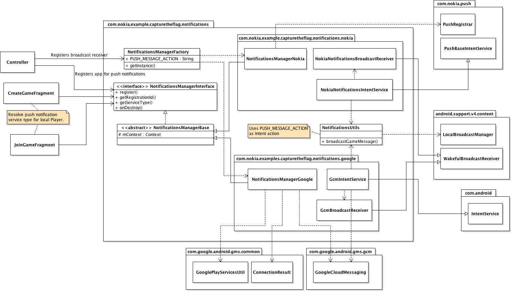

# Push notifications #

## Usage ##

The game uses push notifications for sending a message from the game server to
all game clients when a flag is captured and the game ends. For push
notifications, the game uses **Nokia Notifications** on **Nokia X** platform and
**Google Cloud Notifications** (**GCN**) on **Android** devices.

Receiving push notifications requires adding the necessary permissions and
declaring broadcast receivers for both types of push notifications to the
application's manifest file.

Push notification implementation on the client application-side consists of two
parts:

* Registering application for push notifications
* Receiving and handling of push notifications

Push notification registration is done through the
`NotificationsManagerInterface` which encapsulates the platform-specific
registration implementation. Push notifications on both platforms are received
and handled through `BroadcastReceiver`s.

## `NotificationsManagerInterface` ##

The `NotificationsManagerInterface` interface declares the following methods:

* `void register()`: Registers the application for push notifications and stores
  the registration ID for later use. Uses existing registration ID if available. 
* `String getRegistrationId()`: Returns the push notification registration ID
  for the application.
* `NotificationServiceType getServiceType()`: Returns the push notification
  service type in use: `NotificationServiceType.NOKIA_NOTIFICATIONS` on
  **Nokia X** platform, `NotificationServiceType.GOOGLE_CLOUD_MESSAGING` on
  **Android** devices.
* `void onDestroy()`: Releases any allocated push notification resources.
 
## Registering for push notifications ##

The `Controller`, on its creation, registers the game to the platform specific
push notification mechanism (**Nokia Notifications** or **GCM**) for receiving
push notifications by getting the notifications manager singleton instance
implementing the `NotificationsManagerInterface` interface by calling
`NotificationsManagerFactory.getInstance(Context context)` and then the
`register()` method declared in the interface.

The `register()` method checks whether the application has an existing
registration ID for receiving push notifications. If an ID exists the
applications uses it, otherwise a new registration ID will be obtained. For
**Nokia Notifications** storing the registration ID is handled automatically by
`com.nokia.push.PushRegistrar` but for **GCM** the application has to handle
storing the registration ID by itself. The game uses
`android.preference.PreferenceManager` for that. 

The registration ID, along with information about the platform the game is
running on (**Nokia X** or **Google Android**), is then sent to the game server
when the player either starts a new game (see `CreateGameFragment`) or joins an
existing game (see `JoinGameFragment`). The game server uses the platform
information and registration id to send push notification messages for that
particular application instance using either the **Nokia Notifications Service
API** or **GCM Connection Server**.

When the `Controller` is destroyed it calls the `onDestroy()` method of the
`NotificationsManagerInterface` to release any push notification related
allocated resources.

## Receiving push notifications ##

The declared receiver implementations, for **Nokia Notifications** the
`NokiaNotificationsBroadcastReceiver` and for **GCM** the
`GcmBroadcastReceiver`, will then receive the push notifications and pass them
on to the corresponding intent services for handling. The
`NokiaNotificationsIntentService` and `GcmIntentService` will then handle the
push notification intent by using
`NotificationsUtils.broadcastGameMessage(String message, Context context)` to
broadcast the received message locally inside the application.

The `Controller` in its `onResume()` registers and in `onPause()` unregisters a
`BroadcastReceiver mPushHandler` for receiving the local broadcast messages. The
`mPushHandler`, when receiving an `Intent`, parses the broadcasted message into
a Player data for flag capturer and displays the `GameEndedDialogFragment` and
ends the current game.

## Server-side push notification implementation ##

When the example game server detects that a player has captured the other team's
flag it notifies all the players in the game using push notifications that the
game has ended.

The server groups the connected players into groups based on the player's
platform information (either "nokia" or "google"), see `sendPushNotification()`
in `utils.js`, and uses the **Nokia Notifications Service API** to send a pus
 message to all players using **Nokia X** platform devices and **GCM Connection
 Server** to send the same push message to players using **Android** devices.

**Nokia Notifications Service API** usage is implemented in the
`sendNokiaNotifications(players, payload)` function. For **GCM** message sending
the example server uses `node-gcm` module which is used in
`sendGoogleNotifications(players, payload)`.

## Related documentation ##

* [Nokia Notifications (Nokia X Developer's Library)](http://developer.nokia.com/resources/library/nokia-x/nokia-notifications.html)
* [Google Cloud Messaging for Android (developers.google.com)](http://developer.android.com/google/gcm/index.html)
* [node-gcm module (GitHub)](https://github.com/ToothlessGear/node-gcm)
